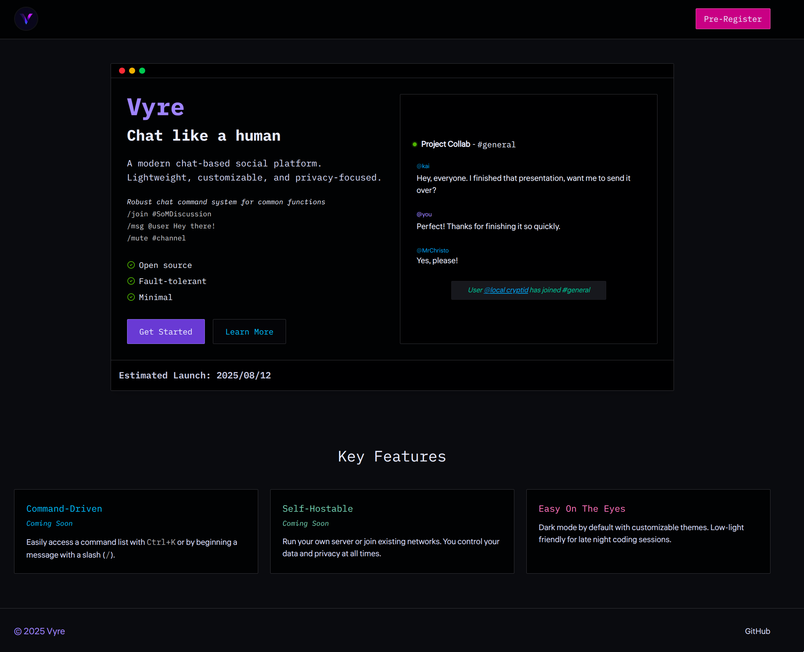

# Vyre

I've been increasingly frustrated with Discord as of late. So, I made my own!
The general idea is to create a chat application inspired by classic IRC client with the modern bells and whistles you're accustomed to.
It's built to be fast, secure, and easy to use without sacrificing scalability or cutting corners.

Check out the [Wiki](https://github.com/aileks/Vyre/wiki)!

### Feature Goals

- [x] User authentication & authorization
- [x] User settings panel
- [x] Chat commands list
- [x] User statuses
- [ ] Real-time chat
- [ ] Chat commands
- [ ] Rich text support
- [ ] Group chats
- [ ] User profiles
- [ ] Notifications system
- [ ] Private messages
- [ ] Server admin panel
- [ ] Probably some other thing I'm forgetting...

### Project Stack

#### Backend

- **Language**: Elixir because functional (and BEAM).
- **Framework**: [Phoenix](https://phoenixframework.org/) because scalable.
- **ORM**: Ecto because flexible.

#### Frontend

- **Language**: TypeScript because type safety.
- **Library**: [Solid.js](https://www.solidjs.com/) because signals.
- **Bundler & Runtime**: [Bun](https://bun.sh/) because speedy.
